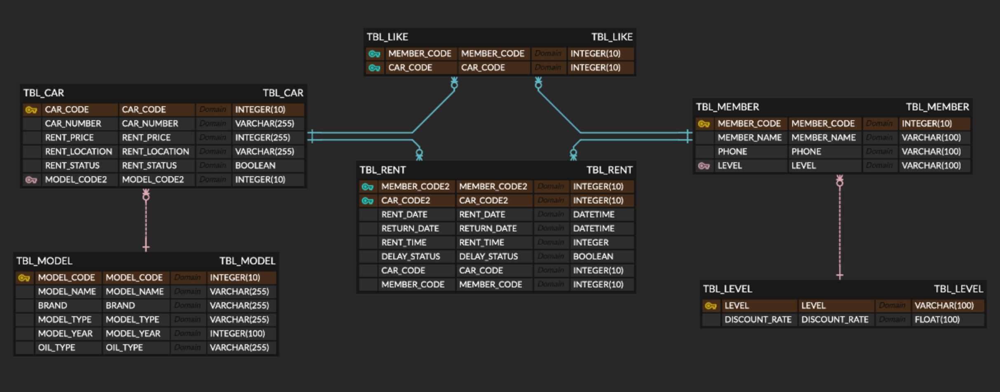

# 🚗 자동차 대여 서비스 (RentCar Service)

## 📌 프로젝트 소개
본 프로젝트는 Java 기반의 자동차 대여 시스템으로, **회원 관리**, **차량 관리**, **대여 이력 관리** 등의 기능을 제공합니다.

## 🛠️ 기술 스택
- Java
- MySQL
- MyBatis

## 🤝 협업 도구
- GitHub
- Notion

## 🗂️ 디렉토리 구조

```
mybatis-crud-practice
└──src
    └── main
        ├── java
        │ └── rentcar
        │    ├── common
        │    ├── controller
        │    ├── mapper
        │    ├── model
        │    │   ├── dao
        │    │   ├── dto
        │    │   └── service
        │    └── run
        └── resources
            └── rentcar
                └── mapper
```


## 🗃️ 데이터베이스 모델링


### 🔗 테이블 관계 설명
- `TBL_MEMBER (회원)` ↔ `TBL_LEVEL (등급)`: 1:N 관계  
  (한 등급을 여러 회원이 가질 수 있음)
- `TBL_MEMBER` ↔ `TBL_RENT` ↔ `TBL_CAR`: 대여 내역을 통한 다대다 관계
- `TBL_MEMBER` ↔ `TBL_LIKE`: 회원이 찜한 차량 정보 저장
- `TBL_CAR` ↔ `TBL_MODEL`: 차량 모델 정보 연동

### 📋 주요 테이블 설명
- `TBL_MEMBER`: 회원 정보 (이름, 연락처, 등급 등)
- `TBL_CAR`: 차량 정보 (차량번호, 대여료, 위치, 상태 등)
- `TBL_RENT`: 대여 내역 (대여일, 반납일, 연체 여부 등)
- `TBL_LIKE`: 회원이 찜한 차량 정보
- `TBL_LEVEL`: 회원 등급 및 할인율
- `TBL_MODEL`: 차량 모델 및 사양 정보

## ✨ 주요 기능
- 등급 테이블과 조인하여 회원 전체 조회 (등급, 할인율 포함)
- 등급 테이블과 조인하여 회원 코드로 특정 회원 조회
- 회원 정보 등록
- 회원 코드로 특정 회원 정보 수정
- 회원 코드로 특정 회원 정보 삭제

## ✅ C1Z4 정보
- PM : 김시은
- CM : 이지은
- DBA : 류지원, 안지명
- Document Manager : 황지희

